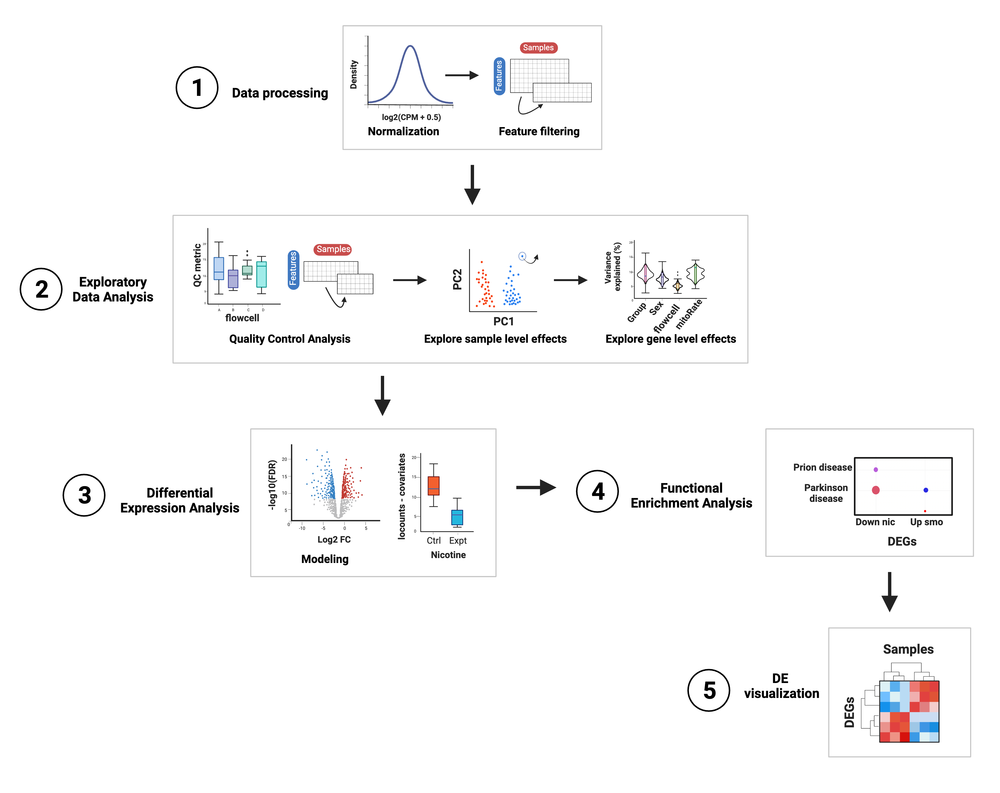

# Data processing 

<style>
p.comment {
background-color: #E6E6E6;
padding: 9px;
border: 1px solid black;
border-radius: 10px;
font-family: sans-serif;
}

</style>

In the following plot you can find the basic workflow for differential expression analysis (DEA) that we will follow using the bulk RNA-seq data from the `smokingMouse` package. 

<figure>
    
        <figcaption style="color: gray; line-height: 1.1; text-align: justify">
            <font size="-1.8">
                <b>Figure 1</b>: <b> Summary of the analyses for differential expression. </b> 
                <b> 1. Data processing</b>: in this initial part counts are normalized and scaled and low-expressed genes are filtered.
                <b> 2. Exploratory Data Analysis</b>: the quality of the samples is compared, poor-quality samples are removed and both gene-level and sample-level effects are explored.
                <b> 3. Differential Expression Analysis</b>: a linear model is fitted for each gene and log fold changes are obtained for the comparison of interest; other statistics are also computed. Here the differentially expressed genes (DEGs) are detected. 
                <b> 4. Functional Enrichment Analysis</b>: in this part Gene Ontology and KEGG enrichment analyses are performed to identify biological processes and functions in which DEGs are significantly involved. 
                <b> 5. DEG visualization</b>: heatmaps are created to visually contrast gene expression levels of DEGs in control and experimental samples. </font>
            <font size="0.8"> 
            Abbreviations: CPM: counts per million; QC: quality control; PC: principal component; FC: fold change; FDR: False Discovery Rate; DEG: differentially expressed gene; GO: Gene Ontology; KEGG: Kyoto Encyclopedia of Genes and Genomes.
            </font>
        </figcaption>
</figure>

## Data preparation

The very first step of the analysis is to normalize the counts and filter non and lowly-expressed genes but we won't do the processes themselves since we already have normalized and filtered data but let's check why these steps are important, how to perform them and where to extract the data we need for posterior analyses.  

### Data normalization
 
Data normalization is a relevant preliminary step when working with expression data because raw counts do not necessarily reflect real expression measures of the genes, since there are technical differences in the way the libraries are prepared and sequenced, as well as intrinsic differences in the genes that are translated into more or less mapped reads. Particularly, there are *within-sample effects* that are the differences between genes in the same sample, such as their **length** (the longer the gene, the more reads it will have) and **GC content**, factors that contribute to variations in their counts. On the other hand, *between-sample effects* are differences between samples such as the **sequencing depth**, i.e., the total number of molecules sequenced, and the **library size**, i.e., the total number of reads of each sample [1].

These variables lead to virtually different mRNA amounts but of course are not due to the biological or treatment conditions of interest (such as nicotine administration in this example) so in order to remove, or at least, to minimize this technical bias and obtain measures comparable and consistent across samples, raw counts must be normalized by these factors. The data that we'll use in this case are already normalized in `assays(rse_gene)$logcounts`. Specifically, the assay contains counts per million (CPM), also known as reads per million (RPM), one basic gene expression unit that only normalizes by the sequencing depth and is computed by dividing the read counts of a gene in a sample by a scaling factor given by the total mapping reads of the sample per million [2]:

$$CPM = \frac{read \ \ counts \ \ of \ \ gene \ \ \times \ \ 10^6 }{Total \ \ mapping \ \ reads \ \ of \ \ sample}$$ 


As outlined before, the scaling factors were obtained with `calcNormFactors()` applying the Trimmed Mean of M-Values (TMM) method, the `r BiocStyle::Biocpkg("edgeR")` package's default normalization method that assumes that most genes are not differentially expressed. The effective library sizes of the samples and the CPM of each observation were computed with the `r BiocStyle::Biocpkg("edgeR")` function `cpm()` setting the `log` argument to `TRUE` and `prior.count` to 0.5 to receive values in $log_2(CPM+0.5)$.

<p class="comment">
❓ ***But why do we apply a log-transformation?***  It turns out that normalizing biological data, such as RNA-seq data, is not only necessary to make it comparable across different samples but is also required for analysis of lineal models as it is assumed by many comparative statistical methods that the data are normally distributed. A second requirement is that the variance in gene expression is the same in all conditions being compared, but on the original expression-scale the conditions with larger observations will have bigger variation than conditions with smaller expression values [3]. 
When we take the logarithm of gene expression data we come closer to satisfying those 2 conditions. **Why?** As described in the original paper of Box and Cox (1964), after a suitable data transformation, such as a logarithmic one, observations of a random variable can follow a distribution (on the transformed scale) that is approximately normal [4]. The second thing that occurs is that on the log-scale the variance of the expression values in the 2 conditions is closer to a constant [3].
</p>

After data normalization and scaling, we’d expect the read counts to follow approximately a normal distribution, something we can confirm by comparing the counts' distribution before and after the normalization. Consider both datasets contain the exact same genes. 

```{r Data preparation, message=FALSE, warning=FALSE}

## Load data
library("SummarizedExperiment")
library('ExperimentHub')
eh <- ExperimentHub::ExperimentHub()
myfiles <- query(eh, "smokingMouse")
rse_gene <- myfiles[['EH8313']] 
## Nicotine data
rse_gene_nic <- rse_gene[, which(rse_gene$Expt == "Nicotine")]

library("ggplot2")

## Histogram and density plot of read counts before and after normalization

## Raw counts
counts_data <- data.frame(counts = as.vector(assays(rse_gene_nic)$counts))
plot <- ggplot(counts_data, aes(x = counts)) +
    geom_histogram(colour = "black", fill = "lightgray") +
    labs(x = "read counts", y = "Frecuency") +
    theme_classic()
plot + theme(plot.margin = unit(c(2, 4, 2, 4), "cm"))

## Normalized logcounts
logcounts_data <- data.frame(logcounts = as.vector(assays(rse_gene_nic)$logcounts))
plot <- ggplot(logcounts_data, aes(x = logcounts)) +
    geom_histogram(aes(y = ..density..), colour = "darkgray", fill = "lightgray") +
    theme_classic() +
    geom_density(fill = "#69b3a2", alpha = 0.3) +
    labs(x = "log(CPM+0.5)", y = "Frecuency")
plot + theme(plot.margin = unit(c(2, 4, 2, 4), "cm"))
```

As presented, after data transformation, we can now see a more widespread distribution of the counts, but note that most of them are zeros in the first plot (the one with the raw counts) and those zeros remain after normalization, corresponding to counts below 0 in the second plot. That is because we haven't filtered the lowly and zero-expressed genes. 


### Gene filtering

Lowly-expressed or non-expressed genes in many samples are not of biological interest in a study of differential expression because they don't inform about the gene expression changes and they are, by definition, not differentially expressed, so we have to remove them. `smokingMouse` genes were filtered with `filterByExpr()` from `r BiocStyle::Biocpkg("edgeR")` that only keeps genes with at least *K* CPM in *n* samples and with a minimum total number of counts across all samples.

```{r,  message=FALSE, warning=FALSE}
## Retain genes that passed filtering step
rse_gene_filt <- rse_gene_nic[rowData(rse_gene_nic)$retained_after_feature_filtering == TRUE, ]

## Normalized counts and filtered genes
filt_logcounts_data <- data.frame(logcounts = as.vector(assays(rse_gene_filt)$logcounts))

## Plot
plot <- ggplot(filt_logcounts_data, aes(x = logcounts)) +
    geom_histogram(aes(y = ..density..), colour = "darkgray", fill = "lightgray") +
    theme_classic() +
    geom_density(fill = "#69b3a2", alpha = 0.3) +
    labs(x = "log(CPM+0.5)", y = "Frecuency")
plot + theme(plot.margin = unit(c(2, 4, 2, 4), "cm"))
```

In this third plot we can observe a curve that is closer (though not completely) to a normal distribution and with less lowly-expressed genes. 

With the object `rse_gene_filt` we can proceed with downstream analyses. 


## References {-}

1. Evans, C., Hardin, J., & Stoebel, D. M. (2018). Selecting between-sample RNA-Seq normalization methods from the perspective of their assumptions. *Briefings in bioinformatics*, 19(5), 776-792.

2. Bedre, R. (2023). Gene expression units explained: RPM, RPKM, FPKM, TPM, *DESeq*, TMM, SCnorm, GeTMM, and ComBat-Seq. Web site: https://www.reneshbedre.com/blog/expression_units.html

3. The Pennsylvania State University. (2018). Statistical Analysis of Genomics Data. Web site: https://online.stat.psu.edu/stat555/node/36/

4. Carey, V. (2023). Exploratory data analysis and visualization. CSHL course of Statistical Analysis for Genome Scale Data 2023. Web site: https://vjcitn.github.io/CSHstats/index.html

